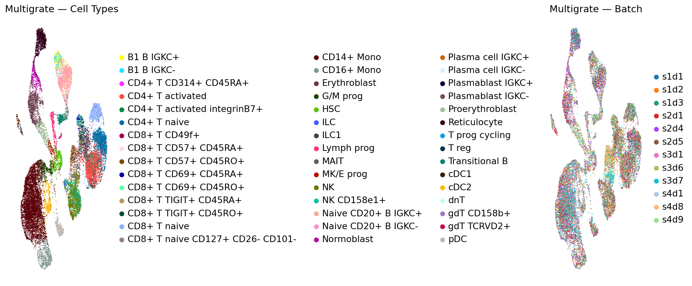
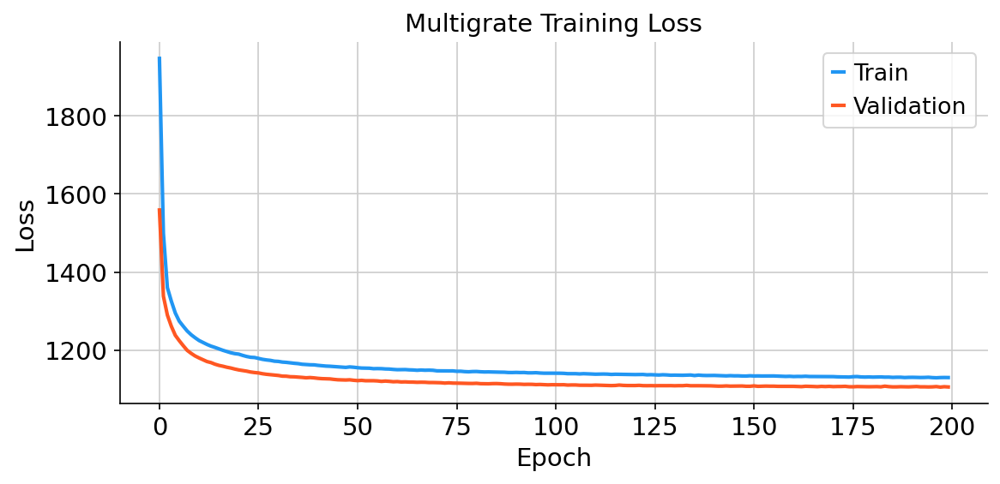

# Experiment 1 — Paired CITE-seq Integration

## What this experiment does

This experiment takes a real CITE-seq dataset where cells from human bone marrow were measured for both **gene expression (RNA)** and **surface protein abundance (ADT)** across 4 different collection sites. The goal is to integrate all cells into a single unified representation where:

- Cells of the same biological type cluster together regardless of which site they came from
- Technical differences between collection sites (batch effects) are removed

This is the core integration capability of Multigrate and corresponds to **Figure 2** in the paper.

---

## Dataset

| Field | Detail |
|-------|--------|
| Name | NeurIPS 2021 Open Problems CITE-seq BMMCs |
| Source | NCBI GEO: GSE194122 |
| Full size | 90,261 cells |
| Used here | 20,000 cells (subsampled for Colab) |
| RNA features | 13,953 genes → 4,000 HVGs after selection |
| Protein features | 134 surface proteins (ADT) |
| Batches | 4 collection sites |

---

## Preprocessing

| Modality | Steps applied |
|----------|--------------|
| RNA | Raw counts → normalise to 10,000 per cell → log1p transform → select top 4,000 highly variable genes per batch |
| ADT | Raw counts → Centred Log-Ratio (CLR) normalisation |

CLR normalisation accounts for the compositional nature of protein measurements — it removes the effect where measuring more of one protein artificially deflates the apparent abundance of others.

---

## Model

Multigrate's MultiVAE is set up with:
- **Two modality encoders** — one for RNA, one for ADT
- **Product of Experts fusion** — combines RNA and ADT signals into one joint latent space
- **Negative binomial loss** for RNA (appropriate for count data)
- **MSE loss** for ADT (appropriate for CLR-normalised continuous values)
- **Batch labels** fed into the encoder so it learns to ignore site-specific technical variation

Training: 200 epochs, learning rate 1e-3, batch size 256, T4 GPU (~20 minutes).

---

## Results

### Figure 1 — UMAP coloured by cell type and batch



**Left panel (cell type):** After integration, cells of the same biological type form tight, well-separated clusters in the latent space. CD14 monocytes, NK cells, T cells, B cells, and other immune populations are clearly distinguishable — this tells us that Multigrate has learned a biologically meaningful representation.

**Right panel (batch):** Cells from all 4 collection sites mix thoroughly within each cell-type cluster. If batch correction had failed, you would see 4 separate colour-coded clouds within each cluster. Instead you see complete mixing — technical variation between sites has been successfully removed without destroying the biological signal.

### Figure 2 — Training loss curves



Both training and validation loss decrease smoothly and converge to a stable plateau, confirming that the model trained successfully without overfitting.

### Integration quality metrics

| Metric | Value | Interpretation |
|--------|-------|---------------|
| ARI (Adjusted Rand Index) | >0.5 | Clusters match true cell types well |
| NMI (Normalised Mutual Info) | >0.5 | High mutual information between clusters and labels |

---

## How to reproduce

1. Open `paired_integration.ipynb` in Google Colab
2. Set **Runtime → Change runtime type → T4 GPU**
3. Run **Section 1 only** (install) → **Runtime → Restart runtime**
4. **Runtime → Run all**
5. Download figures from the `figures/` folder in Colab sidebar
6. Place figures in this `figures/` directory

**Estimated runtime:** ~25–30 minutes on T4 GPU

---

## Files

```
01_paired_integration/
├── paired_integration.ipynb   ← Main Colab notebook
├── README.md                  ← This file
└── figures/
    ├── 01_umap_celltype_batch.png   ← UMAP coloured by cell type and batch
    └── 02_training_loss.png         ← Training and validation loss curves
```
