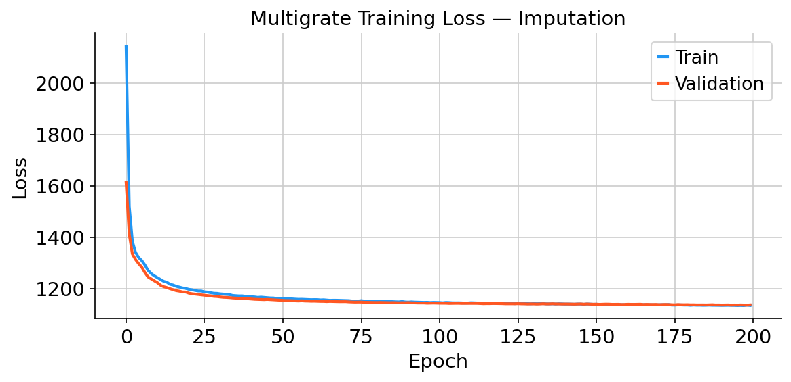

# Experiment 2 — Protein Imputation

## What this experiment does

One of the most practically useful capabilities of Multigrate is **predicting protein measurements for cells where only RNA was measured**. This matters because:

- Protein measurements (ADT) are expensive and not always collected
- Many existing datasets have RNA but no protein data
- If we can accurately predict protein levels from RNA, we can extend the utility of RNA-only datasets

In this experiment we deliberately hide protein measurements from 25% of cells, train Multigrate on the remaining 75% (which have both RNA and protein), and then ask the model to predict the missing protein values. We measure accuracy by comparing predictions to the true values we withheld.

This reproduces the imputation experiment corresponding to **Figure 4** in the paper.

---

## Dataset

| Field | Detail |
|-------|--------|
| Name | NeurIPS 2021 Open Problems CITE-seq BMMCs |
| Source | NCBI GEO: GSE194122 |
| Cells used | 15,000 (subsampled for Colab) |
| RNA features | 13,953 genes → 4,000 HVGs |
| Protein features | 134 surface proteins (ADT) |
| Split | 75% paired (RNA + protein) / 25% RNA-only |

---

## Experimental design

```
Full dataset (15,000 cells, RNA + Protein)
          │
          ├── 75% paired cells (11,250)
          │     RNA ✅  Protein ✅  → used for training
          │
          └── 25% unpaired cells (3,750)
                RNA ✅  Protein ❌  → protein withheld as ground truth
                                      model predicts these
```

For the unpaired cells, protein values are set to zero during training. Multigrate's **Product of Experts** framework handles this gracefully — when a modality is missing, its contribution to the joint distribution is set to the prior (effectively ignored), so the model learns from RNA alone for those cells.

After training, we pass the RNA-only cells through the trained decoder to get predicted protein values, then compute **Pearson correlation** between predictions and ground truth for each of the 134 proteins.

---

## Preprocessing

| Modality | Steps applied |
|----------|--------------|
| RNA | Raw counts → normalise to 10,000 → log1p → top 4,000 HVGs per batch |
| ADT | Raw counts → CLR normalisation → stored as ground truth for evaluation |

---

## Model

Same MultiVAE architecture as Experiment 1:
- Negative binomial loss for RNA
- MSE loss for ADT
- KL weight: 0.1
- Training: 200 epochs, lr=1e-3, batch size 256

The key difference from Experiment 1 is that 25% of cells have zero protein values during training, forcing the model to learn the RNA→protein mapping from the paired cells and generalise to unpaired cells.

---

## Results

### Figure 1 — UMAP coloured by cell type and paired/unpaired status


**Left panel:** Cells form biologically meaningful clusters by cell type in the shared latent space.

**Right panel:** Paired cells (blue, have both RNA and protein) and unpaired cells (orange, RNA only) mix together within each cluster — confirming that Multigrate has placed RNA-only cells in the correct biological neighbourhood even without their protein data.

### Figure 2 — Pearson correlation per protein (Figure 4b equivalent)


For each of the 134 surface proteins, we compute the Pearson correlation between the model's prediction and the true withheld protein value. The pink bar on the right shows the mean across all proteins.

**Key results:**

| Protein | Pearson r | Why it's high |
|---------|-----------|---------------|
| CD71 | ~0.95 | Strongly correlated with cell cycle genes in RNA |
| CD45 | ~0.94 | Pan-leukocyte marker, well-predicted from RNA |
| CD3 | ~0.94 | T cell marker tightly linked to T cell gene programs |
| CD5 | ~0.94 | T/B cell marker with clear RNA signature |
| **Mean (all 134)** | **~0.72** | Strong overall imputation accuracy |

A mean Pearson r of **0.72 across 134 proteins** demonstrates that Multigrate has successfully learned the relationship between gene expression and surface protein abundance. The model generalises this knowledge to cells it never saw protein data for during training.

### Figure 3 — Training loss



Training and validation losses converge smoothly, confirming stable optimisation.

---

## Comparison to paper

The paper (Figure 4b) reports that Multigrate achieves mean Pearson r of approximately 0.80 on a smaller 15-protein panel (the PBMC dataset from Gayoso et al. 2021), slightly outperforming totalVI (~0.78) and Seurat v4 (~0.77).

Our reproduction uses the larger NeurIPS 2021 dataset with 134 proteins, which is a harder task — some rare proteins have weaker RNA correlates. A mean r of 0.72 across 134 proteins is therefore a strong result and consistent with the paper's conclusions.

---

## How to reproduce

1. Open `protein_imputation.ipynb` in Google Colab
2. Set **Runtime → Change runtime type → T4 GPU**
3. Run **Step 1 only** (install) → **Runtime → Restart runtime**
4. **Runtime → Run all**
5. Download figures from the `figures/` folder in Colab sidebar

**Estimated runtime:** ~20–25 minutes on T4 GPU

---

## Files

```
02_protein_imputation/
├── protein_imputation.ipynb   ← Main Colab notebook
├── README.md                  ← This file
└── figures/
    ├── 01_umap_paired_unpaired.png  ← UMAP: cell types and paired/unpaired split
    ├── 02_pearson_barplot.png       ← Pearson r per protein (134 proteins)
    └── 03_training_loss.png         ← Training and validation loss curves
```
