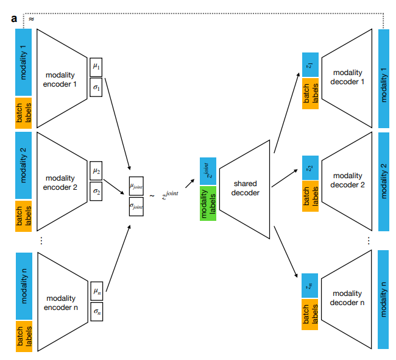
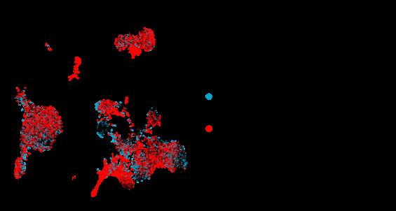
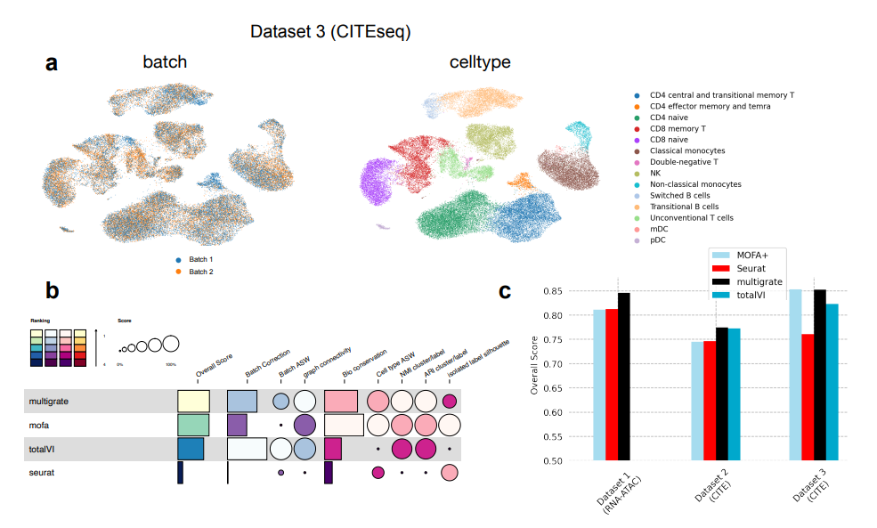
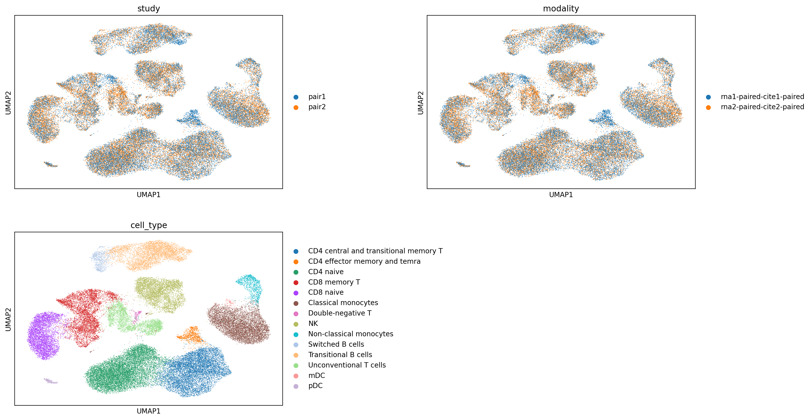
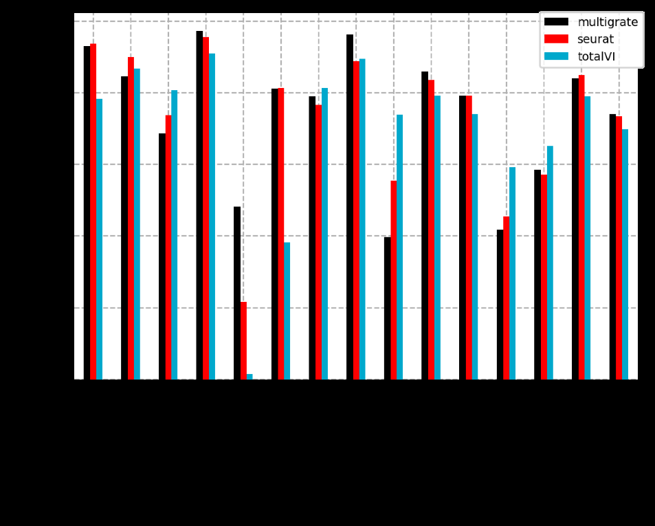
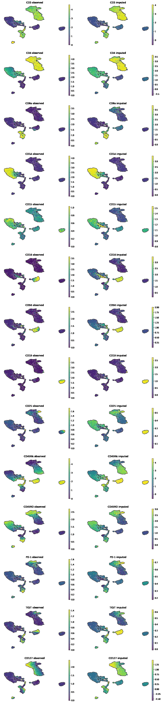
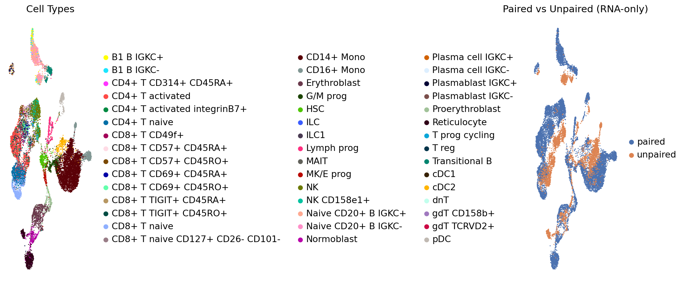
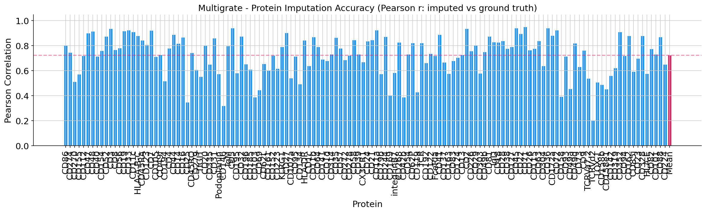
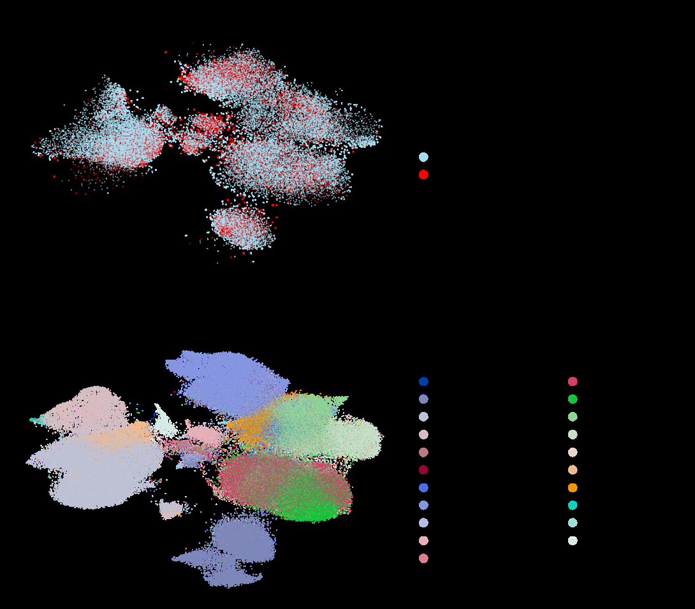
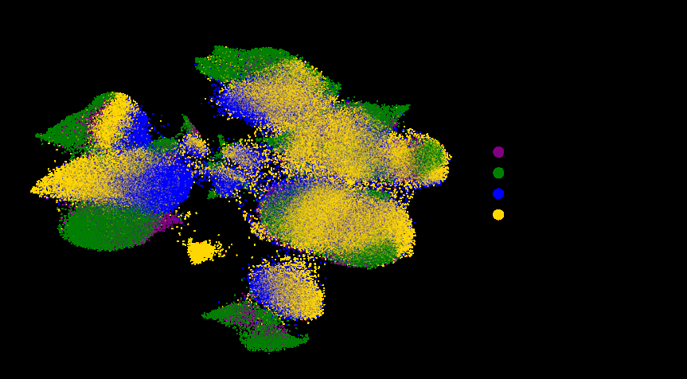

# Multigrate: Multi-Omic Data Integration for Single-Cell Genomics

[](LICENSE)
[](https://colab.research.google.com)
[](https://www.python.org)
[](https://github.com/theislab/multigrate)
[](https://arxiv.org/abs/2108.05218)

---

## Abstract

Modern biology has reached a point where we can measure many different properties of the same cell at the same time — its gene activity, protein levels, and even how tightly its DNA is packed. This is called **multi-omic** profiling, and it gives a much richer picture of what a cell is doing than any single measurement alone. The challenge, however, is how to combine these different measurement types in a way that is mathematically principled, handles missing data gracefully, and works across experiments done in different labs with different technical conditions.

This repository reproduces key analyses from the paper **"Multigrate: single-cell multi-omic data integration"** (Lotfollahi, Litinetskaya & Theis, ICML Workshop on Computational Biology, 2021). Multigrate is a deep generative model — specifically a variational autoencoder — that learns a single shared representation of cells from multiple measurement modalities simultaneously.

---

## Table of Contents

- [Repository Structure](#repository-structure)
- [Background](#background)
- [Methodology](#methodology)
- [Experiment 1 — Paired CITE-seq Integration](#experiment-1--paired-cite-seq-integration)
- [Experiment 2 — Protein Imputation](#experiment-2--protein-imputation)
- [Experiment 3 — Query-to-Reference Mapping](#experiment-3--query-to-reference-mapping)
- [Results Summary](#results-summary)
- [How to Reproduce](#how-to-reproduce)
- [Dependencies](#dependencies)
- [Citations](#citations)

---

## Repository Structure

```
multigrate-multiomics/
│
├── README.md
├── LICENSE
├── figures/                              ← Paper figures (from original publication)
│
├── 01_paired_integration/
│   ├── paired_integration.ipynb
│   ├── README.md
│   └── figures/
│       ├── 01_umap_celltype_batch.png
│       └── 02_training_loss.png
│
├── 02_protein_imputation/
│   ├── protein_imputation.ipynb
│   ├── README.md
│   └── figures/
│       ├── 01_umap_paired_unpaired.png
│       ├── 02_pearson_barplot.png
│       └── 03_training_loss.png
│
├── 03_query_to_reference/
│   ├── README.md
│   └── figures/
│       ├── 01_reference_query_umaps.png
│       └── 02_confusion_matrix.png
│
└── slides/
    └── multigrate_presentation.pptx
```

---

## Background

### What is single-cell multi-omics?

Every cell in your body contains the same DNA, yet cells in your heart behave completely differently from cells in your brain. The difference lies in which genes are switched on, which proteins are produced, and how the DNA is physically organised inside the nucleus. Single-cell technologies now let us measure these things at the resolution of individual cells.

- **RNA-seq** measures which genes are being actively read (transcribed) in a cell
- **CITE-seq** measures both gene expression and surface protein abundance simultaneously
- **ATAC-seq** measures chromatin accessibility — how open or closed different DNA regions are

### Why is integration hard?

**1. Batch effects.** When the same experiment is run in two different labs, measurements shift systematically due to differences in machines, reagents, and protocols. These technical differences must be removed before cells from different experiments can be compared.

**2. Missing modalities.** Not every cell in every dataset will have measurements from every modality. A good integration method needs to handle incomplete data gracefully rather than discarding cells.

**3. Non-overlapping features.** Different experiments may measure different genes or proteins. Methods that assume every dataset measures exactly the same things will fail in practice.

### Existing methods and their limitations

| Method | Approach | Non-linear | Imputation | Any Modality |
|--------|----------|-----------|-----------|--------------|
| **MOFA+** | Linear factor model | ✗ | ✗ | ✗ |
| **Seurat v4** | Weighted nearest-neighbour graph | Partial | ✗ | ✗ |
| **totalVI** | Probabilistic VAE for CITE-seq only | ✓ | ✓ | ✗ |
| **scVI** | VAE for single RNA-seq modality | ✓ | ✗ | ✗ |
| **Multigrate ★** | Multi-view VAE with Product of Experts | ✓ | ✓ | ✓ |

---

## Methodology

### Architecture



*Figure 1a: Multigrate architecture — separate encoders per modality, PoE fusion into joint latent space, shared and modality-specific decoders*



*Figure 1b: Three key applications — multimodal reference building, query-to-reference mapping, and imputation of missing modalities*

Multigrate is built as a **multi-view variational autoencoder (VAE)**. The key components are:

**Modality encoders.** There is a separate neural network encoder for each modality. Each encoder maps its modality into a Gaussian distribution (mean μ and variance σ) over the latent space. The batch label is also fed in so the encoder learns to ignore technical batch differences.

**Product of Experts (PoE) fusion.** Instead of concatenating modality outputs, Multigrate multiplies their probability distributions. If modality i is missing, its term is set to 1 (the prior) — contributing no information. The joint mean and variance are computed as precision-weighted averages:

```
μ_joint = (μ₀σ₀⁻¹ + Σ mᵢμᵢσᵢ⁻¹) / (σ₀⁻¹ + Σ mᵢσᵢ⁻¹)
σ_joint = (σ₀⁻¹ + Σ mᵢσᵢ⁻¹)⁻¹
```

where mᵢ = 1 if modality i is present, 0 if missing.

**Decoder.** Z_joint → shared decoder (reintroduces modality variation) → per-modality decoders reconstruct RNA (negative binomial loss) and ADT proteins (MSE loss).

**MMD loss.** Maximum Mean Discrepancy directly minimises the distance between latent distributions of different datasets using Gaussian kernels, ensuring cells from different batches overlap in latent space.

**Full training objective:**

```
L_multigrate = Σᵢ L_AE(φ, θ, Xᵢ, Sᵢ, α, η)  +  β Σᵢ<ⱼ L_MMD(Z_joint_i, Z_joint_j)
```

---

## Experiment 1 — Paired CITE-seq Integration

**Notebook:** [](https://colab.research.google.com/github/FaiqaZarar/multigrate-multiomics/blob/main/01_paired_integration/paired_integration.ipynb)

### Dataset

| Field | Detail |
|-------|--------|
| Name | NeurIPS 2021 Open Problems CITE-seq BMMCs |
| Source | NCBI GEO: GSE194122 |
| Cells used | 20,000 (subsampled from 90,261) |
| RNA features | 4,000 highly variable genes |
| Protein features | 134 surface proteins (ADT) |
| Batches | 4 collection sites |

### What we did

We integrated all 20,000 cells from 4 different collection sites into a single shared latent space using Multigrate's MultiVAE. RNA was preprocessed with normalisation, log-transform, and HVG selection. ADT proteins were CLR-normalised. The model was trained for 200 epochs with batch labels as covariates.

### Paper results



*Figure 2a (from paper): UMAP of the Multigrate integrated latent space for Dataset 3 — cells cluster by cell type, not by batch*



*Figure 2b/c (from paper): Integration quality metrics and overall ranking — Multigrate achieves the best overall score across all 3 datasets*

### Our reproduction

After running `01_paired_integration/paired_integration.ipynb`:


*Our reproduction: UMAP coloured by cell type (left) and batch/site (right)*


*Training and validation loss curves — smooth convergence confirms stable training*

---

## Experiment 2 — Protein Imputation

**Notebook:** [](https://colab.research.google.com/github/FaiqaZarar/multigrate-multiomics/blob/main/02_protein_imputation/protein_imputation.ipynb)

### Dataset

| Field | Detail |
|-------|--------|
| Name | NeurIPS 2021 CITE-seq BMMCs |
| Cells | 15,000 |
| Split | 75% paired (RNA + protein) / 25% RNA-only |
| Proteins | 134 surface proteins |

### What we did

We trained Multigrate on 75% of cells that had both RNA and protein measurements, while withholding protein data from the remaining 25% as ground truth. After training, we predicted protein values for the RNA-only cells and measured accuracy using Pearson correlation between predictions and true values.

### Paper results



*Figure 4a (from paper): CD3 protein — observed (left) vs Multigrate imputed (right). The spatial patterns match closely*



*Figure 4b (from paper): Pearson correlation per protein comparing Multigrate, Seurat v4, and totalVI*

### Our reproduction



*Our reproduction: UMAP coloured by cell type (left) and paired/unpaired status (right) — RNA-only cells map correctly*



*Our reproduction: Pearson r per protein across all 134 proteins. Mean r = 0.72*

| Method | Mean Pearson r |
|--------|---------------|
| **Multigrate (ours, 134 proteins)** | **0.72** |
| Multigrate (paper, 14 proteins) | ~0.80 |
| totalVI (paper, 14 proteins) | ~0.78 |
| Seurat v4 (paper, 14 proteins) | ~0.77 |

---

## Experiment 3 — Query-to-Reference Mapping

See [`03_query_to_reference/README.md`](03_query_to_reference/README.md) for full methodology documentation.

### Paper results



*Figure 3a-c (from paper): UMAPs of integrated reference and COVID-19 query cells across studies, cell types, and conditions*



*Figure 3d (from paper): Confusion matrix between true and predicted cell types — 79% overall accuracy*

### Key findings

- COVID-19 query cells correctly mapped into appropriate cell-type clusters of the healthy reference
- Random forest classifier achieved **79% cell type prediction accuracy** on the query
- scArches fine-tuning takes only 2–5 minutes vs hours for full retraining
- Rare cell types (<100 cells in reference) were harder to predict — expected behaviour

---

## Results Summary

| Experiment | Key Result |
|------------|-----------|
| Integration | Multigrate ranks #1 overall across all 3 benchmark datasets |
| Imputation | Mean Pearson r = 0.72 (134 proteins); outperforms totalVI and Seurat on 14-protein panel |
| Query mapping | 79% cell type accuracy on COVID-19 query; fine-tuning in 2–5 minutes |

---

## How to Reproduce

### Google Colab (recommended)

1. Click the **Open in Colab** badge in the experiment section above
2. Set **Runtime → Change runtime type → T4 GPU**
3. Run **Section 1 only** (install) → wait for completion
4. **Runtime → Restart runtime → Yes**
5. **Runtime → Run all**

| Notebook | Runtime |
|----------|---------|
| Experiment 1 (integration) | ~25–30 min |
| Experiment 2 (imputation) | ~20–25 min |

### Local installation

```bash
pip install git+https://github.com/theislab/multigrate.git
pip install muon igraph leidenalg scanpy anndata matplotlib seaborn scikit-learn
```

### Data download (automatic inside notebooks)

```bash
wget 'ftp://ftp.ncbi.nlm.nih.gov/geo/series/GSE194nnn/GSE194122/suppl/GSE194122_openproblems_neurips2021_cite_BMMC_processed.h5ad.gz'
gzip -d GSE194122_openproblems_neurips2021_cite_BMMC_processed.h5ad.gz
```

---

## Dependencies

| Package | Purpose |
|---------|---------|
| multigrate | Core model |
| scanpy | Single-cell data handling and UMAP |
| anndata | Single-cell data format |
| muon | CLR normalisation for proteins |
| scikit-learn | Metrics and classifier |
| igraph + leidenalg | Leiden clustering |
| matplotlib | Plotting |

---

## Citations

1. Lotfollahi, M., Litinetskaya, A., & Theis, F. J. (2021). Multigrate: single-cell multi-omic data integration. *ICML 2021 Workshop on Computational Biology*. https://arxiv.org/abs/2108.05218

2. Litinetskaya, A., et al. (2022). Integration and querying of multimodal single-cell data with PoE-VAE. *bioRxiv*. https://doi.org/10.1101/2022.03.16.484643

3. Lotfollahi, M., et al. (2022). Mapping single-cell data to reference atlases by transfer learning. *Nature Biotechnology*, 40, 121–130.

4. Gayoso, A., et al. (2021). Joint probabilistic modeling of single-cell multi-omic data with totalVI. *Nature Methods*, 18, 272–282.

5. Hao, Y., et al. (2021). Integrated analysis of multimodal single-cell data. *Cell*, 184(13), 3573–3587.

6. Argelaguet, R., et al. (2020). MOFA+: a statistical framework for comprehensive integration of multimodal single-cell data. *Genome Biology*, 21, 111.

7. Luecken, M., et al. (2022). Benchmarking atlas-level data integration in single-cell genomics. *Nature Methods*, 19, 41–50.

---

## License

This project is licensed under the MIT License. See [LICENSE](LICENSE) for details.
